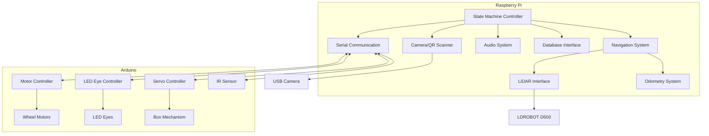
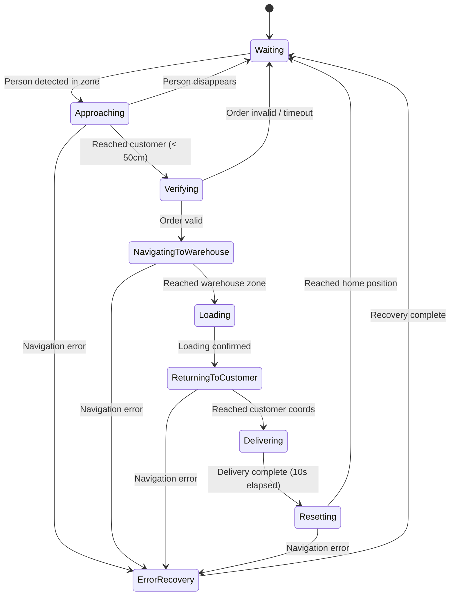

# Design Document: RelayBot Autonomous Delivery System

## Overview

RelayBot is an autonomous delivery robot system built on Arduino and Raspberry Pi hardware. The system implements a state machine architecture to manage the complete delivery workflow: customer detection, order verification, warehouse navigation, package loading, and delivery completion.

The design integrates existing components (QR scanner, SQLite database, Arduino LED control, serial communication) with new autonomous capabilities including LiDAR-based navigation, person detection, audio feedback, and servo-controlled package compartment.

**Key Design Decisions:**

1. **Navigation Approach**: Pure LiDAR-based navigation with known map and particle filter localization (selected over ArUco markers for reliability and lower hardware complexity)
2. **State Machine Pattern**: Finite state machine with clear state transitions and error handling
3. **Modular Architecture**: Separation of concerns across navigation, sensors, state control, communication, and audio subsystems
4. **Coordinate System**: Global absolute coordinates with origin (0,0) at home position
5. **Integration Strategy**: Minimal modifications to existing code, new modules extend functionality

## Architecture

### System Architecture Diagram



### State Machine Diagram



## Components and Interfaces

### 1. State Machine Controller (`state_machine.py`)

**Purpose**: Orchestrates robot behavior through discrete states and manages transitions.

**States**:
- `WAITING`: Robot at home position (0,0), monitoring for customers
- `APPROACHING`: Moving toward detected customer
- `VERIFYING`: Requesting and validating order credentials
- `NAVIGATING_TO_WAREHOUSE`: Traveling to warehouse loading zone
- `LOADING`: Waiting at warehouse for package loading
- `RETURNING_TO_CUSTOMER`: Navigating back to customer's original position
- `DELIVERING`: Opening box and completing delivery
- `RESETTING`: Returning to home position
- `ERROR_RECOVERY`: Handling errors and returning to safe state

**Interface**:
```python
class StateMachine:
    def __init__(self, navigation, audio, order_verifier, serial_comm, lidar):
        """
        Инициализация машины состояний
        
        Args:
            navigation: Система навигации
            audio: Аудио система
            order_verifier: Система проверки заказов
            serial_comm: Последовательная связь с Arduino
            lidar: Интерфейс LiDAR
        """
        pass
    
    def update(self) -> None:
        """Обновление текущего состояния (вызывается в главном цикле)"""
        pass
    
    def transition_to(self, new_state: State) -> None:
        """Переход в новое состояние с логированием"""
        pass
    
    def handle_error(self, error: Exception) -> None:
        """Обработка ошибок и переход в безопасное состояние"""
        pass
```

### 2. Navigation System (`navigation.py`)

**Purpose**: Provides localization, path planning, and movement control for autonomous navigation.

**Navigation Approach Decision**: **Pure LiDAR-based navigation with particle filter localization**

**Rationale**:
- **Reliability**: LiDAR provides consistent 360° environmental data regardless of lighting
- **Simplicity**: No need for marker placement/maintenance or camera calibration
- **Accuracy**: Particle filter with known map provides 5-10cm accuracy in structured environments
- **Cost**: Utilizes existing LDROBOT D500 hardware without additional cameras
- **Robustness**: Less sensitive to environmental changes than visual markers

**Components**:
- **Map Representation**: 2D occupancy grid of warehouse/delivery zone environment
- **Localization**: Particle filter (Monte Carlo Localization) matching LiDAR scans to known map
- **Path Planning**: A* algorithm for global path planning with dynamic obstacle avoidance
- **Motion Control**: Differential drive controller with PID for smooth movement

**Interface**:
```python
class NavigationSystem:
    def __init__(self, map_file: str, lidar_interface, odometry, serial_comm):
        """
        Инициализация системы навигации
        
        Args:
            map_file: Путь к файлу карты окружения
            lidar_interface: Интерфейс LiDAR сенсора
            odometry: Система одометрии
            serial_comm: Связь с Arduino для управления моторами
        """
        pass
    
    def get_current_position(self) -> Tuple[float, float, float]:
        """Получить текущую позицию (x, y, theta) в глобальных координатах"""
        pass
    
    def navigate_to(self, target_x: float, target_y: float) -> bool:
        """
        Навигация к целевой точке
        
        Returns:
            True если достигнута цель, False если ошибка
        """
        pass
    
    def stop(self) -> None:
        """Остановить движение робота"""
        pass
    
    def update_localization(self) -> None:
        """Обновить локализацию на основе данных LiDAR и одометрии"""
        pass
    
    def plan_path(self, start: Tuple[float, float], goal: Tuple[float, float]) -> List[Tuple[float, float]]:
        """Планирование пути от начальной до целевой точки"""
        pass
```

### 3. LiDAR Interface (`lidar_interface.py`)

**Purpose**: Interface with LDROBOT D500 LiDAR sensor for environmental scanning and person detection.

**Interface**:
```python
class LiDARInterface:
    def __init__(self, port: str = '/dev/ttyUSB0', baudrate: int = 230400):
        """
        Инициализация интерфейса LiDAR
        
        Args:
            port: Последовательный порт LiDAR
            baudrate: Скорость передачи данных
        """
        pass
    
    def get_scan(self) -> List[Tuple[float, float]]:
        """
        Получить текущее сканирование
        
        Returns:
            Список точек (расстояние, угол) в полярных координатах
        """
        pass
    
    def detect_person(self) -> Optional[Tuple[float, float]]:
        """
        Обнаружение человека в зоне доставки
        
        Returns:
            Позиция человека (x, y) относительно робота или None
        """
        pass
    
    def get_obstacles(self, min_distance: float = 0.3) -> List[Tuple[float, float]]:
        """
        Получить препятствия ближе заданного расстояния
        
        Returns:
            Список позиций препятствий (x, y)
        """
        pass
```

### 4. Odometry System (`odometry.py`)

**Purpose**: Track robot position through wheel encoder data and sensor fusion.

**Interface**:
```python
class OdometrySystem:
    def __init__(self, wheel_base: float, wheel_radius: float):
        """
        Инициализация системы одометрии
        
        Args:
            wheel_base: Расстояние между колесами (м)
            wheel_radius: Радиус колеса (м)
        """
        pass
    
    def update(self, left_ticks: int, right_ticks: int, dt: float) -> None:
        """
        Обновление одометрии на основе тиков энкодеров
        
        Args:
            left_ticks: Тики левого колеса
            right_ticks: Тики правого колеса
            dt: Временной интервал (секунды)
        """
        pass
    
    def get_pose(self) -> Tuple[float, float, float]:
        """Получить текущую позу (x, y, theta)"""
        pass
    
    def reset(self, x: float = 0.0, y: float = 0.0, theta: float = 0.0) -> None:
        """Сброс одометрии к заданной позиции"""
        pass
```

### 5. Order Verification System (extends existing `qrScanner.py`)

**Purpose**: Scan QR codes, parse order data, and validate against database.

**Modifications to existing code**:
- Add callback mechanism for state machine integration
- Support non-blocking operation
- Add verbal order number input support (future enhancement)

**Interface**:
```python
class OrderVerificationSystem:
    def __init__(self, db_session, serial_comm):
        """
        Инициализация системы проверки заказов
        
        Args:
            db_session: Сессия базы данных
            serial_comm: Связь с Arduino для LED эффектов
        """
        pass
    
    def start_scanning(self, callback: Callable[[bool, Optional[int]], None]) -> None:
        """
        Начать сканирование QR кода
        
        Args:
            callback: Функция обратного вызова (успех, order_id)
        """
        pass
    
    def stop_scanning(self) -> None:
        """Остановить сканирование"""
        pass
    
    def verify_order(self, order_data: str) -> Tuple[bool, Optional[int]]:
        """
        Проверка заказа по данным QR кода
        
        Returns:
            (валидность, order_id)
        """
        pass
```

### 6. Audio System (`audio_system.py`)

**Purpose**: Provide voice and sound feedback for customer and warehouse staff interaction.

**Audio Files Required**:
- `request_qr.wav`: "Пожалуйста, покажите QR код вашего заказа"
- `order_accepted.wav`: "Заказ принят. Еду на склад."
- `order_rejected.wav`: "Заказ не найден. Пожалуйста, проверьте QR код."
- `announce_order_<number>.wav`: "Заказ номер <number>"
- `delivery_greeting.wav`: "Ваш заказ доставлен. Приятного дня!"
- `successScan.wav`: (existing) Success sound
- `failureScan.wav`: (existing) Failure sound

**Interface**:
```python
class AudioSystem:
    def __init__(self, audio_dir: str = 'assets/audio'):
        """
        Инициализация аудио системы
        
        Args:
            audio_dir: Директория с аудио файлами
        """
        pass
    
    def play(self, audio_file: str, blocking: bool = False) -> None:
        """
        Воспроизвести аудио файл
        
        Args:
            audio_file: Имя файла
            blocking: Ждать завершения воспроизведения
        """
        pass
    
    def request_qr_code(self) -> None:
        """Запросить QR код у клиента"""
        pass
    
    def announce_order_accepted(self) -> None:
        """Объявить принятие заказа"""
        pass
    
    def announce_order_rejected(self) -> None:
        """Объявить отклонение заказа"""
        pass
    
    def announce_order_number(self, order_id: int) -> None:
        """Объявить номер заказа на складе"""
        pass
    
    def greet_delivery(self) -> None:
        """Приветствие при доставке"""
        pass
    
    def stop(self) -> None:
        """Остановить воспроизведение"""
        pass
```

### 7. Serial Communication (extends existing `serialConnection.py`)

**Purpose**: Bidirectional communication between Raspberry Pi and Arduino for motor control, LED effects, servo control, and sensor data.

**Protocol Extensions**:

**Raspberry Pi → Arduino Commands**:
- `MOTOR:<left_speed>,<right_speed>,<left_dir>,<right_dir>\n`: Motor control
- `SERVO:<angle>\n`: Servo position (0-90 degrees)
- `SUCCESS_SCAN\n`: (existing) Success LED effect
- `FAILURE_SCAN\n`: (existing) Failure LED effect
- `LED_IDLE\n`: Idle eye animation
- `LED_WAITING\n`: Waiting animation
- `LED_MOVING\n`: Moving animation
- `STOP\n`: Emergency stop

**Arduino → Raspberry Pi Responses**:
- `IR:<distance>\n`: IR sensor reading
- `ENCODER:<left_ticks>,<right_ticks>\n`: Wheel encoder data
- `ACK\n`: Command acknowledged

**Interface Extensions**:
```python
class SerialCommunication:
    # Existing init_serial() function remains
    
    def send_motor_command(self, left_speed: int, right_speed: int, 
                          left_dir: int, right_dir: int) -> None:
        """
        Отправить команду управления моторами
        
        Args:
            left_speed: Скорость левого мотора (0-255)
            right_speed: Скорость правого мотора (0-255)
            left_dir: Направление левого мотора (0/1)
            right_dir: Направление правого мотора (0/1)
        """
        pass
    
    def send_servo_command(self, angle: int) -> None:
        """
        Отправить команду сервоприводу
        
        Args:
            angle: Угол (0-90 градусов)
        """
        pass
    
    def send_led_command(self, command: str) -> None:
        """Отправить команду LED эффекта"""
        pass
    
    def read_sensor_data(self) -> Optional[Dict[str, Any]]:
        """
        Прочитать данные сенсоров от Arduino
        
        Returns:
            Словарь с данными сенсоров или None
        """
        pass
```

### 8. Box Mechanism Controller (`box_controller.py`)

**Purpose**: Control servo motor for package compartment opening/closing.

**Interface**:
```python
class BoxController:
    def __init__(self, serial_comm):
        """
        Инициализация контроллера коробки
        
        Args:
            serial_comm: Связь с Arduino
        """
        pass
    
    def open(self) -> None:
        """Открыть коробку (90 градусов)"""
        pass
    
    def close(self) -> None:
        """Закрыть коробку (0 градусов)"""
        pass
    
    def is_open(self) -> bool:
        """Проверить, открыта ли коробка"""
        pass
```

### 9. Configuration Manager (`config.py`)

**Purpose**: Centralized configuration for all system parameters.

**Configuration Parameters**:
```python
# Координаты зон
HOME_POSITION = (0.0, 0.0)  # Домашняя позиция
WAREHOUSE_ZONE = (5.0, 3.0)  # Зона загрузки склада
DELIVERY_ZONE_RADIUS = 3.0  # Радиус зоны доставки (м)

# Параметры навигации
POSITION_TOLERANCE = 0.1  # Допуск позиции (м)
CUSTOMER_APPROACH_DISTANCE = 0.5  # Расстояние подхода к клиенту (м)
MAX_SPEED = 150  # Максимальная скорость моторов (0-255)
LOCALIZATION_UPDATE_RATE = 10  # Частота обновления локализации (Гц)

# Параметры LiDAR
LIDAR_PORT = '/dev/ttyUSB0'
LIDAR_BAUDRATE = 230400
PERSON_DETECTION_MIN_POINTS = 10  # Минимум точек для обнаружения человека
PERSON_DETECTION_CLUSTER_DISTANCE = 0.3  # Расстояние кластеризации (м)

# Параметры одометрии
WHEEL_BASE = 0.25  # Расстояние между колесами (м)
WHEEL_RADIUS = 0.05  # Радиус колеса (м)
ENCODER_TICKS_PER_REVOLUTION = 360  # Тики энкодера на оборот

# Параметры последовательной связи
ARDUINO_PORT = 'COM10'  # Порт Arduino (Windows) или '/dev/ttyACM0' (Linux)
ARDUINO_BAUDRATE = 9600

# Параметры доставки
DELIVERY_TIMEOUT = 10.0  # Время ожидания забора посылки (секунды)
LOADING_CONFIRMATION_TIMEOUT = 60.0  # Время ожидания загрузки (секунды)
QR_SCAN_TIMEOUT = 30.0  # Время ожидания сканирования QR (секунды)

# Параметры аудио
AUDIO_DIR = 'assets/audio'

# Параметры базы данных
DATABASE_URL = "sqlite:///assets/orders.db"
```

## Data Models

### Database Schema (existing, no changes)

```python
# db/db_models.py (существующий код без изменений)

class Customer(Base):
    __tablename__ = 'customers'
    
    id = Column(Integer, primary_key=True)
    name = Column(String, nullable=False)
    surname = Column(String, nullable=False)
    phone = Column(Integer, nullable=False)
    secret_key = Column(String, nullable=False)
    
    orders = relationship("Order", back_populates="customer")

class Order(Base):
    __tablename__ = 'orders'
    
    id = Column(Integer, primary_key=True)
    customer_id = Column(Integer, ForeignKey("customers.id"))
    
    customer = relationship("Customer", back_populates="orders")
```

### Internal Data Structures

**Position**:
```python
@dataclass
class Position:
    x: float  # Координата X (метры)
    y: float  # Координата Y (метры)
    theta: float  # Ориентация (радианы)
```

**LiDAR Scan Point**:
```python
@dataclass
class ScanPoint:
    distance: float  # Расстояние (метры)
    angle: float  # Угол (радианы)
    intensity: int  # Интенсивность отражения (0-255)
```

**Navigation Waypoint**:
```python
@dataclass
class Waypoint:
    x: float  # Координата X
    y: float  # Координата Y
    tolerance: float = 0.1  # Допуск достижения (метры)
```

**State Context**:
```python
@dataclass
class StateContext:
    current_position: Position
    target_position: Optional[Position]
    customer_position: Optional[Position]  # Сохраненная позиция клиента
    current_order_id: Optional[int]
    error_message: Optional[str]
```

## Correctness Properties

*A property is a characteristic or behavior that should hold true across all valid executions of a system—essentially, a formal statement about what the system should do. Properties serve as the bridge between human-readable specifications and machine-verifiable correctness guarantees.*


### Property Reflection

After analyzing all acceptance criteria, several properties can be consolidated:

**Navigation Accuracy Consolidation**:
- Properties 1.4, 4.4, 6.4, and 9.2 all test position accuracy within 10cm tolerance
- These can be combined into a single comprehensive property: "For any navigation goal, final position is within tolerance"

**Obstacle Avoidance Consolidation**:
- Properties 4.3 and 6.3 both test obstacle avoidance during navigation
- These can be combined into: "For any navigation task, obstacles are avoided"

**LED Animation Consolidation**:
- Properties 1.3 and 8.3 both test idle LED animations in WAITING state
- These can be combined into: "For any WAITING state entry, idle LED commands are sent"

**Box Opening Consolidation**:
- Properties 15.1 and 15.3 both test opening to 90 degrees in different states
- These can be combined into: "For any state requiring open box (LOADING, DELIVERING), servo opens to 90 degrees"

**Box Closing Consolidation**:
- Properties 7.4, 15.2, and 15.4 all test closing to 0 degrees
- These can be combined into: "For any box close trigger (timeout, confirmation), servo closes to 0 degrees"

**Audio Greeting Consolidation**:
- Properties 7.1 and 13.5 both test delivery greeting
- These are identical and can be merged

### Core Correctness Properties

**Property 1: Home Position Return**
*For any* delivery cycle completion or system startup, the robot should navigate to and stop at coordinates (0,0) within 10cm tolerance.
**Validates: Requirements 1.1, 8.2**

**Property 2: Person Detection Triggers Approach**
*For any* person detected in the delivery zone while in WAITING state, the state machine should transition to APPROACHING state.
**Validates: Requirements 2.2**

**Property 3: Customer Disappearance Stops Approach**
*For any* customer tracking loss during APPROACHING state, the robot should stop movement and transition back to WAITING state.
**Validates: Requirements 2.5**

**Property 4: Proximity Triggers Verification**
*For any* approach to customer, when distance becomes less than 50cm, the state machine should stop and transition to VERIFYING state.
**Validates: Requirements 2.6**

**Property 5: QR Code Parsing**
*For any* valid QR code JSON payload containing order_id and secret_key fields, the parser should extract both values correctly.
**Validates: Requirements 3.3**

**Property 6: Order Validation Round Trip**
*For any* order in the database, generating its QR code then validating it should return success with the correct order_id.
**Validates: Requirements 3.4, 3.5**

**Property 7: Invalid Order Rejection**
*For any* QR code with invalid credentials (wrong secret_key or non-existent order_id), validation should fail and trigger rejection audio and return to WAITING state.
**Validates: Requirements 3.6**

**Property 8: Path Planning Completeness**
*For any* pair of valid coordinates in the environment, the navigation system should generate a valid path (non-empty list of waypoints).
**Validates: Requirements 4.1, 6.1, 8.1, 9.3**

**Property 9: Navigation Accuracy**
*For any* navigation goal (warehouse, customer position, home), the final position should be within 10cm of the target coordinates.
**Validates: Requirements 1.4, 4.4, 6.4, 9.2**

**Property 10: Obstacle Avoidance**
*For any* navigation task with obstacles in the path, the planned path should not pass through obstacle positions (maintain minimum 30cm clearance).
**Validates: Requirements 4.3, 6.3**

**Property 11: Customer Position Persistence**
*For any* customer position where QR verification occurs, that position should be stored and retrievable for return navigation.
**Validates: Requirements 5.5**

**Property 12: State Transition Logging**
*For any* state transition, a log entry should be created containing old state, new state, and timestamp.
**Validates: Requirements 10.2**

**Property 13: Error Recovery to Home**
*For any* error condition in any state, the error handler should navigate the robot back to home position (0,0) and transition to WAITING state.
**Validates: Requirements 10.3, 10.5**

**Property 14: LiDAR Update Rate**
*For any* 1-second time window during operation, the LiDAR system should provide at least 10 scan updates.
**Validates: Requirements 11.1**

**Property 15: Localization Update Rate**
*For any* 1-second time window during navigation, the navigation system should provide at least 10 position updates.
**Validates: Requirements 9.7**

**Property 16: Odometry Position Delta**
*For any* pair of consecutive wheel encoder readings, the calculated position change should match the expected delta based on wheel geometry (within 5% error).
**Validates: Requirements 11.5**

**Property 17: Motor Command Latency**
*For any* motor command sent from Raspberry Pi, the Arduino should execute the command within 100ms.
**Validates: Requirements 12.2**

**Property 18: Serial Command Reliability**
*For any* sequence of serial commands sent rapidly (up to 10 commands/second), all commands should be received and acknowledged without loss.
**Validates: Requirements 12.5**

**Property 19: State-LED Mapping**
*For any* state transition, the appropriate LED command should be sent to Arduino (WAITING→idle, APPROACHING→moving, LOADING→waiting, etc.).
**Validates: Requirements 1.3, 8.3, 12.3**

**Property 20: Box Opening Control**
*For any* state requiring open box (LOADING or DELIVERING), the servo command should be sent with angle 90 degrees.
**Validates: Requirements 15.1, 15.3**

**Property 21: Box Closing Control**
*For any* box close trigger (loading confirmation, delivery timeout), the servo command should be sent with angle 0 degrees.
**Validates: Requirements 7.4, 15.2, 15.4**

**Property 22: Delivery Timeout**
*For any* delivery in DELIVERING state, the state should remain DELIVERING for exactly 10 seconds before transitioning to RESETTING.
**Validates: Requirements 7.3**

**Property 23: Audio-State Mapping**
*For any* state requiring audio feedback (VERIFYING→request QR, LOADING→announce order, DELIVERING→greet customer), the correct audio file should be played.
**Validates: Requirements 3.1, 5.1, 7.1, 13.1, 13.4, 13.5**

**Property 24: Coordinate System Consistency**
*For any* position reported by the navigation system, the coordinates should be relative to the global origin (0,0) at home position.
**Validates: Requirements 9.1**

**Property 25: Person Position Reporting**
*For any* person detected by LiDAR, the detection should include valid (x, y) coordinates relative to the robot.
**Validates: Requirements 11.2**

## Error Handling

### Error Categories and Recovery Strategies

**Navigation Errors**:
- **Localization Failure**: If particle filter diverges (high variance), stop movement, attempt re-localization using known landmarks, if failed after 3 attempts → ERROR_RECOVERY state
- **Path Planning Failure**: If no valid path found, log error, wait 2 seconds, retry with relaxed constraints, if failed → ERROR_RECOVERY state
- **Goal Unreachable**: If stuck for >30 seconds without progress, attempt alternate path, if failed → ERROR_RECOVERY state
- **Obstacle Collision**: If IR sensor detects obstacle <10cm, emergency stop, back up 20cm, replan path

**Sensor Errors**:
- **LiDAR Connection Loss**: Attempt reconnection every 5 seconds, continue with odometry-only navigation for up to 30 seconds, if not restored → ERROR_RECOVERY state
- **Camera Failure**: Log warning, continue operation (QR scanning unavailable), notify via audio
- **Encoder Failure**: If encoder data stops updating, log error, switch to LiDAR-only localization, reduce max speed by 50%

**Communication Errors**:
- **Serial Timeout**: If Arduino doesn't respond within 500ms, retry command up to 3 times, if failed → log error and continue (non-critical commands) or ERROR_RECOVERY (motor commands)
- **Command Queue Overflow**: If command queue exceeds 10 items, drop oldest non-critical commands, log warning

**Database Errors**:
- **Connection Failure**: Retry connection up to 3 times with exponential backoff, if failed → reject order and notify customer
- **Query Timeout**: Set 5-second timeout on all queries, if exceeded → treat as invalid order

**Hardware Errors**:
- **Servo Failure**: If servo doesn't reach target position within 2 seconds, retry command, if failed after 3 attempts → log error, continue delivery (manual box opening required)
- **Motor Failure**: If motor doesn't respond to commands, attempt emergency stop, transition to ERROR_RECOVERY state, log critical error

**State Machine Errors**:
- **Invalid Transition**: If invalid state transition requested, log error, remain in current state, attempt recovery action
- **State Timeout**: Each state has maximum duration (VERIFYING: 30s, LOADING: 60s, DELIVERING: 15s), if exceeded → transition to ERROR_RECOVERY

### Error Recovery State Behavior

When entering ERROR_RECOVERY state:
1. Stop all movement immediately
2. Close box mechanism (if open)
3. Play error audio notification
4. Log detailed error information
5. Attempt navigation to home position (0,0)
6. If home navigation succeeds → transition to WAITING
7. If home navigation fails after 3 attempts → enter EMERGENCY_STOP state (requires manual intervention)

## Testing Strategy

### Dual Testing Approach

The RelayBot system requires comprehensive testing using both **unit tests** and **property-based tests**. These approaches are complementary:

- **Unit tests** verify specific examples, edge cases, and integration points
- **Property-based tests** verify universal properties across randomized inputs

### Unit Testing Focus

Unit tests should cover:

1. **Specific Examples**:
   - Known QR code successfully validates against test database
   - Specific path from (0,0) to (5,3) generates expected waypoints
   - State transition from WAITING to APPROACHING with known person position

2. **Edge Cases**:
   - Empty LiDAR scan (no data)
   - QR code with malformed JSON
   - Navigation goal at robot's current position (zero distance)
   - Person detected at exact boundary of delivery zone
   - Encoder ticks overflow (large values)

3. **Integration Points**:
   - Serial communication sends and receives data correctly
   - Database connection and query execution
   - Audio file playback completes without errors
   - LiDAR driver initialization and data streaming

4. **Error Conditions**:
   - LiDAR disconnection during navigation
   - Invalid servo angle commands
   - Database connection failure during order validation
   - Path planning with completely blocked environment

### Property-Based Testing Configuration

**Library Selection**: Use **Hypothesis** for Python property-based testing

**Test Configuration**:
- Minimum **100 iterations** per property test (due to randomization)
- Each test must reference its design document property
- Tag format: `# Feature: relaybot-autonomous-delivery, Property N: <property text>`

**Property Test Coverage**:

Each correctness property (Properties 1-25) should be implemented as a property-based test:

1. **Property 1 (Home Position Return)**: Generate random starting positions, verify navigation to (0,0)
2. **Property 2 (Person Detection)**: Generate random person positions in delivery zone, verify state transition
3. **Property 5 (QR Parsing)**: Generate random valid JSON payloads, verify correct parsing
4. **Property 6 (Order Validation)**: Generate random orders in test database, verify round-trip validation
5. **Property 8 (Path Planning)**: Generate random coordinate pairs, verify valid path generation
6. **Property 9 (Navigation Accuracy)**: Generate random navigation goals, verify final position within tolerance
7. **Property 16 (Odometry)**: Generate random encoder tick sequences, verify position delta calculations
8. **Property 18 (Serial Reliability)**: Generate random command sequences, verify no message loss

**Generators for Property Tests**:

```python
# Генераторы для property-based тестов

@st.composite
def valid_position(draw):
    """Генератор валидных позиций в окружении"""
    x = draw(st.floats(min_value=-5.0, max_value=10.0))
    y = draw(st.floats(min_value=-5.0, max_value=10.0))
    theta = draw(st.floats(min_value=0, max_value=2*math.pi))
    return Position(x, y, theta)

@st.composite
def valid_qr_payload(draw):
    """Генератор валидных QR кодов"""
    order_id = draw(st.integers(min_value=1, max_value=1000))
    secret_key = draw(st.text(min_length=8, max_length=32, alphabet=st.characters(whitelist_categories=('Lu', 'Ll', 'Nd'))))
    return json.dumps({"order_id": order_id, "secret_key": secret_key})

@st.composite
def lidar_scan(draw):
    """Генератор LiDAR сканирований"""
    num_points = draw(st.integers(min_value=100, max_value=500))
    points = []
    for _ in range(num_points):
        distance = draw(st.floats(min_value=0.1, max_value=10.0))
        angle = draw(st.floats(min_value=0, max_value=2*math.pi))
        intensity = draw(st.integers(min_value=0, max_value=255))
        points.append(ScanPoint(distance, angle, intensity))
    return points

@st.composite
def encoder_ticks(draw):
    """Генератор тиков энкодеров"""
    left = draw(st.integers(min_value=-1000, max_value=1000))
    right = draw(st.integers(min_value=-1000, max_value=1000))
    return (left, right)
```

### Test Organization

```
tests/
├── unit/
│   ├── test_state_machine.py
│   ├── test_navigation.py
│   ├── test_lidar_interface.py
│   ├── test_odometry.py
│   ├── test_order_verification.py
│   ├── test_audio_system.py
│   ├── test_serial_communication.py
│   └── test_box_controller.py
├── property/
│   ├── test_navigation_properties.py
│   ├── test_state_machine_properties.py
│   ├── test_order_verification_properties.py
│   ├── test_odometry_properties.py
│   └── test_serial_properties.py
├── integration/
│   ├── test_full_delivery_cycle.py
│   ├── test_error_recovery.py
│   └── test_hardware_integration.py
└── conftest.py  # Pytest fixtures and test database setup
```

### Testing Guidelines

1. **Avoid Excessive Unit Tests**: Don't write 50 unit tests for variations of the same behavior—use property tests for input variation coverage
2. **Focus Unit Tests**: Use unit tests for concrete examples that demonstrate correct behavior and specific edge cases
3. **Property Test Tagging**: Every property test must include a comment with the property number and text from this design document
4. **Test Database**: Use separate SQLite test database with known test data for order validation tests
5. **Mock Hardware**: Mock Arduino serial communication and LiDAR hardware for unit/property tests
6. **Integration Tests**: Run integration tests with actual hardware in controlled environment
7. **Continuous Testing**: Run unit and property tests on every code change; run integration tests before deployment

### Example Property Test

```python
from hypothesis import given, settings
import hypothesis.strategies as st

@given(start=valid_position(), goal=valid_position())
@settings(max_examples=100)
def test_path_planning_completeness(start, goal):
    """
    Feature: relaybot-autonomous-delivery, Property 8: Path Planning Completeness
    For any pair of valid coordinates in the environment, 
    the navigation system should generate a valid path.
    """
    nav_system = NavigationSystem(map_file="test_map.yaml", 
                                   lidar_interface=MockLiDAR(),
                                   odometry=MockOdometry(),
                                   serial_comm=MockSerial())
    
    path = nav_system.plan_path((start.x, start.y), (goal.x, goal.y))
    
    # Проверки
    assert path is not None, "Path should not be None"
    assert len(path) > 0, "Path should contain at least one waypoint"
    assert path[0] == (start.x, start.y), "Path should start at start position"
    assert path[-1] == (goal.x, goal.y), "Path should end at goal position"
```

## Implementation Notes

### File Structure

```
relaybot/
├── main.py                      # Главный файл (модифицированный)
├── state_machine.py             # Новый: машина состояний
├── navigation.py                # Новый: система навигации
├── lidar_interface.py           # Новый: интерфейс LiDAR
├── odometry.py                  # Новый: система одометрии
├── audio_system.py              # Новый: аудио система
├── box_controller.py            # Новый: контроллер коробки
├── config.py                    # Новый: конфигурация
├── qrScanner.py                 # Существующий (минимальные изменения)
├── serialConnection.py          # Существующий (расширения)
├── ideal_program.ino            # Существующий (расширения)
├── db/
│   ├── db.py                    # Существующий (без изменений)
│   ├── db_models.py             # Существующий (без изменений)
│   └── functions.py             # Существующий (без изменений)
├── assets/
│   ├── audio/                   # Новая директория для аудио файлов
│   │   ├── request_qr.wav
│   │   ├── order_accepted.wav
│   │   ├── order_rejected.wav
│   │   ├── delivery_greeting.wav
│   │   ├── successScan.wav      # Существующий
│   │   └── failureScan.wav      # Существующий
│   ├── maps/                    # Новая директория для карт
│   │   └── warehouse_map.yaml
│   └── orders.db                # Существующая база данных
├── tests/                       # Новая директория для тестов
│   ├── unit/
│   ├── property/
│   ├── integration/
│   └── conftest.py
└── requirements.txt             # Обновленный с новыми зависенциями
```

### Dependencies

New Python packages required:
```
hypothesis>=6.0.0          # Property-based testing
numpy>=1.20.0              # Numerical computations
scipy>=1.7.0               # Scientific computing (particle filter)
pyserial>=3.5              # Serial communication (existing)
opencv-python>=4.5.0       # Computer vision (existing)
sqlalchemy>=1.4.0          # Database ORM (existing)
playsound3>=1.0.0          # Audio playback (existing)
pyyaml>=5.4.0              # YAML configuration files
```

### Arduino Code Extensions

The existing `ideal_program.ino` needs extensions for:

1. **Motor Control**: Add motor command parsing and PWM control
2. **Servo Control**: Add servo library and position control
3. **Encoder Reading**: Add interrupt-based encoder tick counting
4. **IR Sensor**: Add IR distance sensor reading
5. **Command Protocol**: Extend serial protocol for new commands

**Key additions**:
```cpp
#include <Servo.h>

// Servo
Servo boxServo;
#define SERVO_PIN 9

// Encoders
#define ENCODER_L_A 2
#define ENCODER_L_B 3
#define ENCODER_R_A 18
#define ENCODER_R_B 19

volatile long leftTicks = 0;
volatile long rightTicks = 0;

// Command parsing
void parseCommand(String cmd) {
  if (cmd.startsWith("MOTOR:")) {
    // Parse: MOTOR:<left_speed>,<right_speed>,<left_dir>,<right_dir>
    // ...
  } else if (cmd.startsWith("SERVO:")) {
    // Parse: SERVO:<angle>
    // ...
  } else if (cmd == "SUCCESS_SCAN") {
    eyesSuccessEffect();
  } else if (cmd == "FAILURE_SCAN") {
    eyesFailureEffect();
  }
  // ...
}
```

### Integration with Existing Code

**Minimal modifications to existing files**:

1. **main.py**: Replace main loop with state machine initialization and update loop
2. **qrScanner.py**: Add callback mechanism, make scanning non-blocking
3. **serialConnection.py**: Add new command functions, maintain backward compatibility
4. **ideal_program.ino**: Add new command handlers, keep existing LED code unchanged

**Integration strategy**:
- New modules import and use existing modules
- Existing modules remain functional independently
- State machine orchestrates all components
- Configuration file centralizes all parameters

### Development Phases

**Phase 1: Core Infrastructure**
- Implement state machine skeleton
- Implement serial communication extensions
- Implement configuration management
- Unit tests for core components

**Phase 2: Navigation System**
- Implement LiDAR interface
- Implement odometry system
- Implement particle filter localization
- Implement path planning (A*)
- Property tests for navigation

**Phase 3: Sensor Integration**
- Integrate LiDAR with navigation
- Implement person detection
- Implement obstacle avoidance
- Unit tests for sensor processing

**Phase 4: State Machine Logic**
- Implement all state behaviors
- Integrate navigation with state machine
- Integrate order verification
- Property tests for state transitions

**Phase 5: Hardware Control**
- Extend Arduino code for motors/servo/encoders
- Implement box controller
- Implement audio system
- Integration tests with hardware

**Phase 6: Error Handling & Polish**
- Implement error recovery
- Add comprehensive logging
- Performance optimization
- Full system integration tests

## Conclusion

This design provides a comprehensive architecture for the RelayBot autonomous delivery system. The pure LiDAR-based navigation approach offers reliability and accuracy without requiring additional hardware. The modular design with clear interfaces enables independent development and testing of components. The state machine architecture provides predictable behavior and robust error handling. The dual testing strategy with both unit and property-based tests ensures correctness across all scenarios.

The design integrates seamlessly with existing code while adding autonomous capabilities, maintaining the working QR scanner, database, and LED control systems. Russian comments throughout the codebase will ensure maintainability for the development team.
